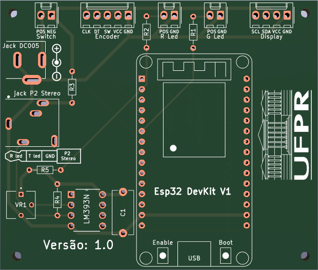

# Photogate_V2
I recomend use the second version (improve precise, security, 3D model, interface and schematic): 
https://github.com/Lorxi3D/PhotogateV2

# Objetivo

- [x] Programar o Esp32 com interface para cada experimento, assim facilitando o aluno realizar os experimentos;
- [x] Criar um diagrama e um modelo 3D do Circuito; 
- [x] Modelar 3D todo o projeto, para uma impressão 3D;
- [x] Publica trabalho (doi.org/10.1088/1361-6552/ad6d23).

# Bibliotecas usadas
- `encoder_menu.py`: https://github.com/MarcioBulla/encodermenu
- `rotary.py` e `rotary_irq_esp.py`: https://github.com/miketeachman/micropython-rotary

# Montagem
[Lista de itens e montagem](http://htmlpreview.github.io/?https://github.com/MarcioBulla/Cronometro-Optico/blob/main/manual/Item_List.html)

.png)
