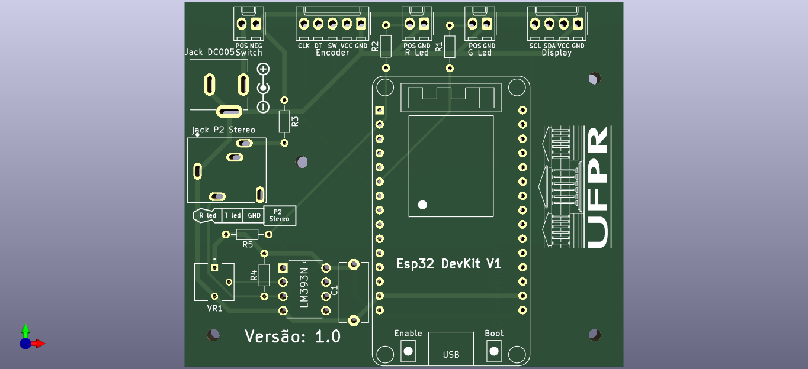

# Objetivo

- [x] Programar o Esp32 com interface para cada experimento, assim facilitando o aluno realizar os experimentos;
- [x] Criar um diagrama e um modelo 3D do Circuito; 
- [ ] Modelar 3D todo o projeto, para uma impressão 3D;
- [ ] Escrever um manual para auxiliar na manutenção ou construções de novos;
- [ ] Publica trabalho sobre essa minha experiência.

# Bibliotecas usadas
- `encoder_menu.py`: https://github.com/MarcioBulla/encodermenu
- `rotary.py` e `rotary_irq_esp.py`: https://github.com/miketeachman/micropython-rotary

# Montagem
[Lista de itens e montagem](http://htmlpreview.github.io/?https://github.com/MarcioBulla/Cronometro-Optico/blob/main/photogate/Item_List.html)

.png)
